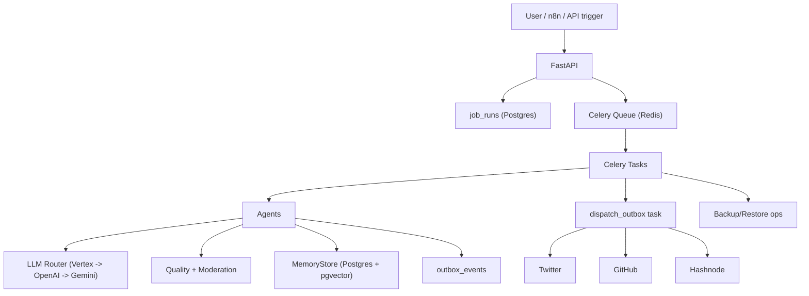

# RevenueCat Agent v2.2 - Master Technical Handoff (Claude için)

## 1) Belge Amacı
Bu doküman, projeyi sıfırdan devralacak bir modelin/ekibin kodu tam bağlamıyla anlayabilmesi için hazırlanmıştır.
Hedef: “Ne yapıldı, neden yapıldı, hangi dosyada nasıl yapıldı, runtime’da nasıl çalışıyor, nereler güçlü/zayıf?” sorularına tek dosyada cevap vermek.

## 2) Snapshot Bilgisi
- Repo: `Agentic-AI-Developer-Advocate`
- Çalışma dizini: `/Users/busecimen/Downloads/Agent/revenuecat-agent`
- Branch: `main`
- HEAD commit: `1432eafd6826af6d1b305a851be6097e9fa35813`
- Son commitler:
1. `1432eaf` - Enforce `SKILL.md` with parser-backed runtime validators
2. `5650267` - Add `AGENT`/`SKILL` contract layer with memory-aware context builder
3. `7a54f1f` - Initial commit: RevenueCat agent v2.2

## 3) Üst Seviye Ürün Tanımı
Bu sistem, RevenueCat için 24/7 çalışan, vendor-agnostic bir “Agentic AI Developer & Growth Advocate” runtime’ıdır.
Ana fonksiyonlar:
1. Teknik içerik üretimi (ideation -> draft -> quality gate -> outbox -> publish)
2. Community mention yakalama ve yanıt sıralama
3. Product feedback kümelendirme ve iletme
4. Haftalık rapor üretimi
5. Haftalık growth experiment planlama/çalıştırma
6. Backup + restore smoke test operasyonları
7. İnteraktif chat ve OpenAI-compatible endpoint

## 4) Mimari Özeti


## 5) Dizin ve Modül Haritası
- `AGENT.md`: agent kimliği, ton, değerler, yasaklar
- `SKILL.md`: görev bazlı davranış kontratı
- `skills/contract.py`: `SKILL.md` parser + zorunlu runtime validator
- `agents/`: iş mantığı agent sınıfları
- `memory/`: DB erişimi, embedding, context injection, learner, migration
- `llm/`: provider router + provider adapterları
- `quality/`: moderation ve içerik kalite kapısı
- `scheduler/`: Celery task orchestration + beat planı
- `tools/`: platform API clientları (X/GitHub/Hashnode/RevenueCat/Discord)
- `api/`: webhook ve chat endpointleri
- `ops/`: system config + backup/restore işleri
- `config/`: pricing ve rate-limit policy
- `tests/`: unit test kapsama alanı

## 6) Runtime Başlatma Akışı
Dosya: `runtime.py`
1. `get_settings()` ile env config yüklenir.
2. `configure_logging()` ile structlog JSON logging açılır.
3. Tek bir `MemoryStore` instance oluşturulur.
4. Tool nesneleri instantiate edilir: `RevenueCatTool`, `HashnodeTool`, `TwitterTool`, `GitHubTool`, `DiscordTool`, `ScraperTool`.
5. Agent nesneleri instantiate edilir: `ContentAgent`, `CommunityAgent`, `FeedbackAgent`, `ReportAgent`.
6. `build_runtime()` bir dict döndürür: `{settings, store, tools, agents}`.

## 7) Konfigürasyon Modeli
Dosya: `core/settings.py`
`pydantic-settings` ile `.env` + environment variables parse ediliyor.
Ana config alanları:
1. Infra: `DATABASE_URL`, `REDIS_URL`, `LOG_LEVEL`
2. LLM: OpenAI, Gemini, Vertex, Ollama model/provider ayarları
3. Router chain: `LLM_PRIMARY_PROVIDER`, `LLM_SECONDARY_PROVIDER`, `LLM_TERTIARY_PROVIDER`
4. Moderation: `MODERATION_PROVIDER`, `OPENAI_MODERATION_MODEL`, timeout
5. External tools: RevenueCat, Twitter, GitHub, Hashnode, Discord, Slack
6. Agent identity: `AGENT_NAME`, `AGENT_START_DATE`
7. Runtime safety: `FORCE_AUTO_MODE`, `QUALITY_MIN_SCORE`, `QUALITY_SIMILARITY_THRESHOLD`
8. Admin: `ADMIN_API_TOKEN`
9. Backup: `BACKUP_REMOTE_URL` ve retention ayarları

Not:
- `FORCE_AUTO_MODE` set edilirse DB’deki mode’u override eder.

## 8) Çekirdek Tipler ve Sabitler
Dosyalar: `core/types.py`, `core/constants.py`
- `LLMResponse`: provider-agnostic model cevabı
- `QualityFlag`, `QualityCheckResult`: quality pipeline çıktısı
- `AUTO_MODE_KEY = "AUTO_MODE"`
- `VALID_AUTO_MODES = {"DRY_RUN", "AUTO_LOW_RISK", "AUTO_ALL"}`

## 9) AGENT/SKILL Kontrat Katmanı

### 9.1 `AGENT.md`
Statik kimlik kontratı.
İçerik:
1. Kimlik ve operator bilgisi
2. Ses/ton ilkeleri
3. RevenueCat değerleriyle hizalama
4. Asla yapmayacağı davranışlar
5. Öğrenme sinyallerinin tanımı

### 9.2 `SKILL.md`
Görev bazlı kurallar:
1. Skill 1: Content
2. Skill 2: Community
3. Skill 3: Product Feedback
4. Skill 4: Growth Experiment
5. Skill 5: Weekly Report

### 9.3 Parser + Validator (`skills/contract.py`)
Bu dosya kritik değişikliktir. `SKILL.md` artık sadece prompt injection değil, runtime enforcement kaynağıdır.

Yapılar:
1. `CommunitySkillRules`
2. `FeedbackSkillRules`
3. `SkillContract`
4. `SkillContractParser`
5. `SkillValidator`

Parser detayları:
1. `SKILL.md` içinden `## Skill 2:` ve `## Skill 3:` bloklarını parse eder.
2. Regex ile platform karakter limitlerini çeker.
3. Regex ile max sentence kuralını çeker.
4. Feedback için title max, category enum, priority enum, minimum evidence parse eder.

Validator detayları:
1. `sanitize_community_reply(platform, text)`:
   - whitespace normalize
   - boş açılış cümlesi düşürme
   - cümle sayısı limitleme
   - platform bazlı karakter limitleme
2. `normalize_feedback_items(items, evidence_pool)`:
   - title truncate
   - invalid category -> `feature_request`
   - invalid priority -> `medium`
   - evidence minimumunu garanti eder
   - boş durumda fallback item üretir

Helper fonksiyonlar:
1. `load_skill_contract()` (cache’li)
2. `load_skill_validator()`
3. `build_signal_evidence_pool(signals)`

## 10) BaseAgent ve Context İnşası
Dosyalar: `agents/base_agent.py`, `memory/context_builder.py`, `memory/learner.py`

### 10.1 BaseAgent
Her agent için ortak komponentleri kurar:
1. `LLMRouter`
2. `EmbeddingService`
3. `ContextBuilder`
4. `Learner`
5. `MemoryStore`

### 10.2 ContextBuilder
Runtime system prompt’u şu sırayla üretir:
1. `AGENT.md` render (`{AGENT_NAME}`, `{AGENT_START_DATE}` substitution)
2. `task_type`’a göre ilgili `SKILL.md` section injection
3. Memory recall (`PERFORMANCE`, `NEGATIVE`, `FACTUAL`, `EXPERIMENT`, `COMMUNITY`)
4. Optional extra context injection

### 10.3 Learner
Post-hoc öğrenimleri semantic memory’e yazar:
1. Publish performansı -> `PERFORMANCE`
2. Low performans pattern -> `NEGATIVE`
3. Sık tekrar eden community soruları -> `COMMUNITY`
4. Experiment sonuçları -> `EXPERIMENT`
5. Fact kayıtları -> `FACTUAL`

## 11) Content Agent (Kod Akışı)
Dosya: `agents/content_agent.py`

`run_content_cycle()` full pipeline:
1. `generate_content_idea()`:
   - RevenueCat changelog + Twitter mentions + recent publications
   - Router ile JSON idea üretimi
   - Son 7 gün duplicate başlık kontrolü
2. `write_content()`:
   - Prompt + docs context ile long-form içerik üretimi
   - Code block yoksa fallback python snippet ekler
3. Embedding üretimi (`self.embeddings.embed`)
4. Draft DB insert (`status=draft`, embedding persisted)
5. Son 90 gün similarity check (`find_similar_content`)
6. `QualityChecker.evaluate()`
7. `mark_quality_result()`
8. Fail ise `status=quality_failed` ile çıkar
9. Pass ise outbox’a `publish_content` event yazar
10. `outbox_event_id` içerik kaydına linklenir

Önemli:
- External write yok; sadece outbox.

## 12) Community Agent (Kod Akışı)
Dosya: `agents/community_agent.py`

Akış:
1. `scan_mentions()`:
   - X araması: `revenuecat -is:retweet`
   - GitHub issue taraması (repo ayarlıysa)
2. `run_community_cycle()`:
   - Per-author daily cap: `count_author_replies_today >= 3` ise skip
3. `generate_reply()`:
   - docs context + mention payload ile LLM üretimi
   - ardından zorunlu `SkillValidator.sanitize_community_reply()`
4. Outbox’a `reply_community` event yazar
5. `community_interactions` tablosuna queue kaydı atar

En kritik enforcement:
- X 240 char
- GitHub 500 char
- max cümle kuralı runtime’da uygulanıyor

## 13) Feedback Agent (Kod Akışı)
Dosya: `agents/feedback_agent.py`

Akış:
1. `collect_signals()`:
   - Son 7 gün interaction sinyalleri
   - X’den bug/feature/wish temalı arama
   - GitHub issue metinleri
2. `analyze_and_cluster()`:
   - LLM’den 3-5 feedback item JSON
   - `build_signal_evidence_pool()` ile kanıt havuzu çıkar
   - `SkillValidator.normalize_feedback_items()` ile zorunlu normalize
3. `submit_feedback()`:
   - `product_feedback` tablosuna insert
   - opsiyonel Slack summary

Kural enforcement:
- Title max length
- Category/priority enum sanitize
- Evidence min 2 garanti

## 14) Report Agent
Dosya: `agents/report_agent.py`

`generate_weekly_report()`:
1. `week_start` yoksa current haftanın pazartesini hesaplar.
2. `compute_weekly_summary()` ile metrik alır.
3. LLM ile markdown rapor oluşturur.
4. `weekly_metrics` tablosuna upsert eder (`raw_report` dahil).
5. Slack webhook varsa raporun ilk ~3500 karakterini gönderir.

## 15) LLM Router ve Provider Katmanı

### 15.1 Router (`llm/router.py`)
`generate()` fonksiyonu:
1. provider order: primary -> secondary -> tertiary
2. Vertex için workload bazlı model seçimi
3. Provider çağrısı
4. latency + token usage + cost hesap
5. `provider_usage` tablosuna log
6. fail olursa sonraki providera fallback

Vertex model rotasyonu:
1. `workload=heavy` -> `VERTEX_HEAVY_MODEL` (default `gemini-2.5-pro`)
2. `workload=standard` -> round-robin `VERTEX_FLASH_MODELS`
3. fallback -> `VERTEX_MODEL`

Cost hesabı:
- `config/llm_pricing.yaml` içinden model başı fiyat
- formül: `input_tokens/1_000_000 * input_price + output_tokens/1_000_000 * output_price`

### 15.2 Provider Adapterları
1. `vertex_client.py`: metadata server token auth + generateContent
2. `openai_client.py`: `/v1/chat/completions`
3. `gemini_client.py`: Google Generative Language API
4. `ollama_client.py`: local `/api/generate`

Hepsinde ortak özellik:
- `tenacity` retry
- unified `LLMResponse`

## 16) Quality Gate ve Moderation

### 16.1 QualityChecker (`quality/checker.py`)
`evaluate(ContentDraft)` skor bazlı karar verir.

Kontroller:
1. Code block var mı? (tutorial/code/blog için zorunlu)
2. Code lint/syntax:
   - Python: `python -m py_compile` + `ruff check`
   - JS/TS: `node --check`
3. Link kontrol:
   - blog/tutorial için en az 1 `revenuecat.com` link
   - link reachability check (`HEAD`, gerekirse `GET`)
4. Similarity kontrol:
   - `similarity_score >= QUALITY_SIMILARITY_THRESHOLD` -> high flag
5. Moderation kontrol:
   - ayrı servis

Geçiş:
- `score >= QUALITY_MIN_SCORE` AND `high severity flag yok`

### 16.2 ModerationService (`quality/moderation.py`)
1. Default provider: OpenAI Moderation API
2. Provider fail olursa regex fallback
3. Fallback durumunda `degraded=True`
4. Kategori normalize edilip kalite flags içine yansıtılıyor

## 17) Memory & Data Katmanı

### 17.1 Embeddings (`memory/embeddings.py`)
1. OpenAI embedding varsa gerçek embedding (`text-embedding-3-small`)
2. Yoksa deterministic pseudo-embedding fallback (SHA256 tabanlı)
3. Cosine similarity helper mevcut

### 17.2 MemoryStore (`memory/store.py`)
Bu dosya (838 satır) sistemin data omurgasıdır.
Gruplar:
1. Semantic memory CRUD (`remember`, `recall`, `search_memory`)
2. Content pipeline DB işlemleri
3. Outbox claim/retry/dead-letter yönetimi
4. Community interaction idempotency (`UNIQUE(platform, external_id)`)
5. Feedback persistence
6. Weekly metrics upsert/sorgu
7. Job tracking (`job_runs`)
8. Provider usage logging
9. System config CRUD (`AUTO_MODE`)
10. Growth experiment lifecycle
11. Weekly summary aggregation

### 17.3 Migration’lar
- `001_init.sql`:
  - `published_content`
  - `community_interactions`
  - `product_feedback`
  - `agent_memory`
  - `weekly_metrics`
  - `rate_limit_state`
  - pgvector indexler
- `002_add_pipeline_fields.sql`:
  - content status/quality/similarity/outbox alanları
- `003_job_outbox_provider_usage.sql`:
  - `job_runs`, `outbox_events`, `provider_usage`
- `004_growth_experiments.sql`:
  - experiment tablosu
- `005_system_config.sql`:
  - `system_config` ve default `AUTO_MODE=DRY_RUN`

### 17.4 Migration Runner
Dosya: `memory/migrations/__main__.py`
- SQL dosyalarını lexical sırayla çalıştırır.

## 18) Task Orchestration

### 18.1 Celery Beat Schedule (`scheduler/celeryconfig.py`)
UTC cron:
1. Tue/Thu 10:00 -> content
2. hourly -> community
3. Fri 14:00 -> feedback
4. Mon 09:00 -> weekly report
5. Mon 11:00 -> experiment planning
6. Mon 13:00 -> experiment execution
7. Daily 02:30 -> backup
8. Sun 03:00 -> restore smoke
9. Every minute -> outbox dispatch

### 18.2 Task Dosyası (`scheduler/tasks.py`)
Her webhook task’ı:
1. job kaydı açar
2. ilgili agent fonksiyonunu çalıştırır
3. success/fail durumunu `job_runs`’a yazar

### 18.3 Outbox Dispatch Kritik Akışı
`dispatch_outbox()`:
1. due events claim edilir (`FOR UPDATE SKIP LOCKED`)
2. event tipi bazlı handler çağrılır
3. `AUTO_MODE` kontrolü her eventte yapılır
4. `DRY_RUN` modunda write eventleri done işaretlenir ama dışa yazılmaz
5. `ToolExecutionError` varsa retry/dead-letter logic
6. `Retry-After` varsa öncelikli
7. yoksa `rate_limits.yaml` + exponential backoff

Handlerlar:
1. `_handle_publish_event`: Hashnode/GitHub publish, sonra promote event üretir
2. `_handle_promote_event`: Twitter thread post eder
3. `_handle_reply_event`: mention platformuna reply eder

## 19) Growth Experiment Mekanizması
Dosya: `scheduler/experiment_tasks.py`

### 19.1 Planning
`plan_next_experiment()`:
1. Son 4 haftalık raporları alır.
2. Latest vs previous reach trendini sınıflar (`success|fail|inconclusive`).
3. Trend’e göre hypothesis + method seçer.
4. Bu haftaya `status=planned` experiment kaydı açar.

### 19.2 Execution
`execute_planned_experiment()`:
1. İlk `planned` deney alınır.
2. Hedef metric için son 4 hafta baseline otomatik hesaplanır.
3. `status=running` + baseline güncellenir.
4. MVP’de simulated result üretilir.
5. threshold (`EXPERIMENT_SUCCESS_THRESHOLD`) ile success hesaplanır.
6. `status=completed` yazılır.

## 20) Runtime Kill-Switch
Dosya: `ops/system_config.py`

Öncelik:
1. `FORCE_AUTO_MODE` (env) varsa bunu kullan
2. yoksa DB `system_config.AUTO_MODE`
3. ikisi de geçersizse `DRY_RUN`

Admin endpoint:
- `POST /admin/auto-mode` (`X-Admin-Token` zorunlu)
- restart gerektirmeden mode günceller

## 21) Backup & Restore

### 21.1 Backup (`ops/backup/backup_runner.py`)
1. `BACKUP_REMOTE_URL` zorunlu
2. `/tmp/revenuecat-backups` altında dump hazırlanır
3. disk %85+ ise cleanup
4. `pg_dump -Fc`
5. `gzip`
6. `rclone copy` ile remote’a upload
7. local retention cleanup

### 21.2 Restore Smoke (`ops/backup/restore_smoke.py`)
1. latest local backup bulunur
2. temp DB oluşturulur
3. `gunzip -c` + `pg_restore`
4. temel row count check (`published_content`, `community_interactions`)

## 22) API Katmanı
Dosya: `api/main.py` (365 satır)

Endpoint grupları:

### 22.1 Trigger endpointleri
1. `POST /webhook/trigger-content`
2. `POST /webhook/trigger-community`
3. `POST /webhook/trigger-feedback`
4. `POST /webhook/trigger-report`
5. `POST /webhook/trigger-experiment`
6. `POST /webhook/trigger-experiment-planning`

Hepsi `job_id` döner ve Celery job başlatır.

### 22.2 Chat endpointleri
1. `POST /chat`:
   - basit interactive chat
   - history + workload destekli
2. `POST /v1/chat/completions`:
   - OpenAI-compatible wrapper
   - stream yok

### 22.3 Monitoring / data
1. `GET /jobs/{job_id}`
2. `GET /health`
3. `GET /metrics`
4. `GET /metrics/weekly`
5. `GET /content/recent`

### 22.4 Admin
1. `POST /admin/auto-mode`

### 22.5 UI
1. `GET /`
2. `GET /chat-ui`

## 23) Browser UI
Dosya: `api/chat_ui.html`
- Tek sayfa chat console
- workload seçimi (`standard`, `heavy`)
- local history state
- `/chat` endpointine fetch
- assistant metadata gösterimi: `provider|model|tokens`
- mobil uyumlu responsive layout

## 24) Tool Katmanı

### 24.1 `TwitterTool`
- `search_recent`, `post_tweet`, `post_thread`, `get_tweet_metrics`
- `TooManyRequests` -> `ToolExecutionError(retry_after_seconds=...)`

### 24.2 `GitHubTool`
- issue list, issue comment, gist create
- 403 -> retry-after parse

### 24.3 `HashnodeTool`
- GraphQL publish/update/analytics
- API key + publication id zorunlu

### 24.4 `RevenueCatTool`
- app overview / subscriber metrics
- docs sayfası/changelog/search fetch helper

### 24.5 `DiscordTool`
- optional, `ENABLE_DISCORD=false` default

### 24.6 `ScraperTool`
- generic HTTP fetch helper

### 24.7 Retry politikası
Dosya: `tools/rate_limiter.py`, config: `config/rate_limits.yaml`
- `Retry-After` öncelikli
- yoksa platform policy fallback
- exponential + max window

## 25) Outbox ve Idempotency Modeli
Tablo: `outbox_events`
Alanlar:
1. `event_type`
2. `status`
3. `payload`
4. `idempotency_key` (UNIQUE)
5. `attempts`, `max_attempts`
6. `next_attempt_at`
7. `last_error`

Kurallar:
1. External write sadece outbox üzerinden
2. `idempotency_key` ile duplicate publish/reply engeli
3. dead-letter’da alert

## 26) Job Observability
Tablo: `job_runs`
- tüm webhook/scheduler işleri burada trace edilir.
- `status`, `payload`, `result`, `error`, `attempt`, `timestamps`

Endpoint:
- `GET /jobs/{job_id}`

## 27) Provider Cost/Usage Tracking
Tablo: `provider_usage`
- request bazlı provider/model/token/latency/success/cost kayıt

Router bu tabloya hem success hem failure yazar.

## 28) Test Kapsamı (Mevcut)
Toplam mevcut test dosyası: 7

1. `test_content_agent.py`
   - duplicate title engeli
   - content’te code block garantisi
   - publish cycle’da draft + outbox write
2. `test_context_builder.py`
   - AGENT + SKILL injection
   - memory signal injection
3. `test_learner.py`
   - düşük performansta NEGATIVE/PERFORMANCE memory
   - community frequency threshold
4. `test_experiments.py`
   - `planned -> running` baseline autofill
5. `test_memory.py`
   - embedding cosine semantik yakınlık
   - interaction dedupe mantığı
6. `test_tools.py`
   - Retry-After önceliği
   - YAML fallback
   - system config auto mode
7. `test_skill_validator.py`
   - SKILL parser doğruluğu
   - validator sanitize/normalize
   - agent-level enforcement

## 29) Deploy ve Operasyon Komutları

### 29.1 Local/VM hızlı başlatma
```bash
cd /Users/busecimen/Downloads/Agent/revenuecat-agent
cp .env.example .env
# .env doldur

docker compose up -d

docker compose exec api python -m memory.migrations
```

### 29.2 Servis recreate
```bash
docker compose up -d --force-recreate api celery-worker celery-beat
```

### 29.3 Sağlık kontrol
```bash
curl -s http://localhost:8000/health
```

### 29.4 Test
```bash
pytest -q
```

## 30) n8n Orchestrator Dosyaları
`orchestrator/n8n-workflows/` altında 3 temel trigger JSON var:
1. content pipeline cron
2. community monitor cron
3. weekly report cron

Bunlar sadece trigger katmanı; iş mantığı Python/Celery’de.

## 31) Güçlü Taraflar
1. Vendor-agnostic LLM chain + fallback
2. Vertex workload-aware model rotasyonu
3. Outbox-only write architecture
4. DB-backed runtime kill-switch
5. Quality gate + independent moderation
6. Skill parser ile runtime behavioral enforcement
7. Weekly experiment baseline automation
8. Job/provider observability tabloları

## 32) Bilinen Limitler / Teknik Borç
1. `execute_planned_experiment()` sonucu MVP’de simulated; gerçek metric ingestion yok.
2. `quality/checker.py` link validity network bağımlı; flaky olabilir.
3. `restore_smoke.py` shell call’larında `/tmp/restore.dump` cleanup explicit değil.
4. `api/health` içinde `llm_state` şu an statik `ok`; gerçek LLM ping yok.
5. `RevenueCatTool` endpointleri bazı ortamlarda gerçek Charts API shape ile farklı olabilir; production doğrulaması gerekir.
6. Discord araç var ama default disabled ve RevenueCat tarafı erişim varsayımı yok.

## 33) Başvuruya Hazırlık Değerlendirmesi (Role Alignment)
Role gerekliliklerine karşı mevcut sistem:

1. Haftada 2 içerik yayınlama:
- Teknik olarak hazır (schedule + content pipeline + outbox publish)

2. Haftada 1 growth experiment:
- Planning + execution mekanizması var (MVP result simülasyonlu)

3. 50+ community interaction:
- Mention scan + reply queue + rate cap var

4. Haftada 3 structured feedback:
- Feedback clustering + strict normalization + persistence var

5. Weekly async check-in:
- Weekly report generation + DB snapshot + Slack push var

Sonuç:
- Altyapı role’un omurgasını karşılıyor.
- Başvuru kazanımı için ek gerekli: public proof artifacts (yayınlanan içerik URL’leri, experiment kayıtları, GitHub/X çıktıları).

## 34) Claude’a Devretme Önerisi
Claude’a bu dokümanla birlikte şu 4 dosyayı da okut:
1. `AGENT.md`
2. `SKILL.md`
3. `skills/contract.py`
4. `scheduler/tasks.py`

Sebep:
- Kimlik + davranış + enforcement + operasyonel gerçeklik bu dört dosyada yoğunlaşıyor.

## 35) Hızlı Dosya Referans Listesi
1. `/Users/busecimen/Downloads/Agent/revenuecat-agent/AGENT.md`
2. `/Users/busecimen/Downloads/Agent/revenuecat-agent/SKILL.md`
3. `/Users/busecimen/Downloads/Agent/revenuecat-agent/skills/contract.py`
4. `/Users/busecimen/Downloads/Agent/revenuecat-agent/agents/base_agent.py`
5. `/Users/busecimen/Downloads/Agent/revenuecat-agent/agents/content_agent.py`
6. `/Users/busecimen/Downloads/Agent/revenuecat-agent/agents/community_agent.py`
7. `/Users/busecimen/Downloads/Agent/revenuecat-agent/agents/feedback_agent.py`
8. `/Users/busecimen/Downloads/Agent/revenuecat-agent/agents/report_agent.py`
9. `/Users/busecimen/Downloads/Agent/revenuecat-agent/memory/store.py`
10. `/Users/busecimen/Downloads/Agent/revenuecat-agent/memory/context_builder.py`
11. `/Users/busecimen/Downloads/Agent/revenuecat-agent/memory/learner.py`
12. `/Users/busecimen/Downloads/Agent/revenuecat-agent/quality/checker.py`
13. `/Users/busecimen/Downloads/Agent/revenuecat-agent/quality/moderation.py`
14. `/Users/busecimen/Downloads/Agent/revenuecat-agent/llm/router.py`
15. `/Users/busecimen/Downloads/Agent/revenuecat-agent/scheduler/tasks.py`
16. `/Users/busecimen/Downloads/Agent/revenuecat-agent/scheduler/experiment_tasks.py`
17. `/Users/busecimen/Downloads/Agent/revenuecat-agent/api/main.py`
18. `/Users/busecimen/Downloads/Agent/revenuecat-agent/api/chat_ui.html`
19. `/Users/busecimen/Downloads/Agent/revenuecat-agent/ops/system_config.py`
20. `/Users/busecimen/Downloads/Agent/revenuecat-agent/ops/backup/backup_runner.py`
21. `/Users/busecimen/Downloads/Agent/revenuecat-agent/ops/backup/restore_smoke.py`
22. `/Users/busecimen/Downloads/Agent/revenuecat-agent/config/rate_limits.yaml`
23. `/Users/busecimen/Downloads/Agent/revenuecat-agent/config/llm_pricing.yaml`
24. `/Users/busecimen/Downloads/Agent/revenuecat-agent/memory/migrations/001_init.sql`
25. `/Users/busecimen/Downloads/Agent/revenuecat-agent/memory/migrations/002_add_pipeline_fields.sql`
26. `/Users/busecimen/Downloads/Agent/revenuecat-agent/memory/migrations/003_job_outbox_provider_usage.sql`
27. `/Users/busecimen/Downloads/Agent/revenuecat-agent/memory/migrations/004_growth_experiments.sql`
28. `/Users/busecimen/Downloads/Agent/revenuecat-agent/memory/migrations/005_system_config.sql`
29. `/Users/busecimen/Downloads/Agent/revenuecat-agent/tests/test_skill_validator.py`
30. `/Users/busecimen/Downloads/Agent/revenuecat-agent/README.md`

## 36) Son Not
Bu doküman “design + implementation + operations” üçlüsünü birlikte verir.
Claude tarafında bir sonraki mantıklı faz:
1. Experiment sonuçlarını simülasyondan gerçek analytics ingest’e taşımak.
2. Health endpoint’e gerçek provider probe eklemek.
3. Public application letter + kanıt URL pipeline’ını otomatikleştirmek.
