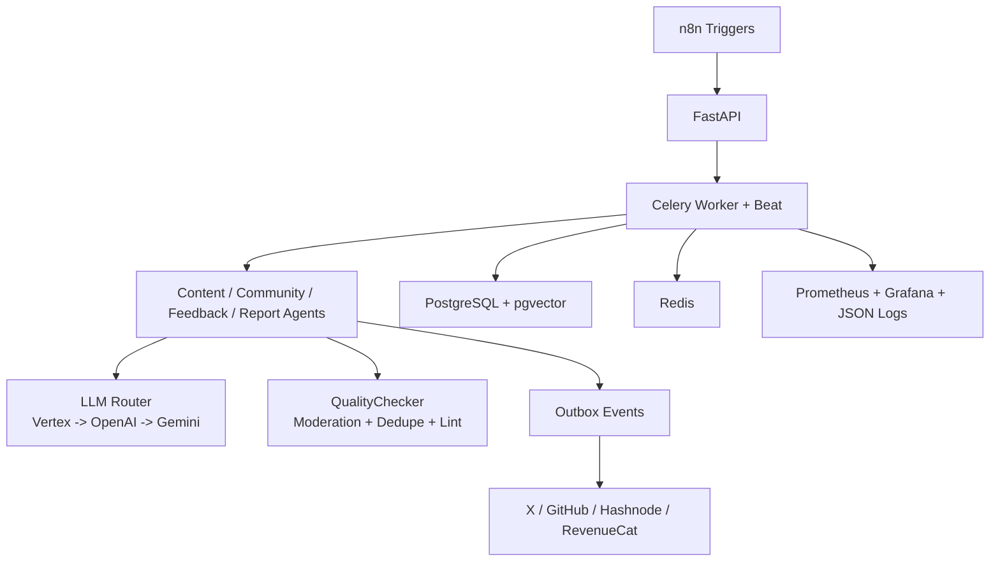

# KairosAgent

> 24/7 autonomous **AI Developer + Growth Advocate** runtime built for the RevenueCat ecosystem.

[](https://github.com/atakanelik34/Agentic-AI-Developer-Advocate)
[](https://github.com/atakanelik34/Agentic-AI-Developer-Advocate)
[](https://github.com/atakanelik34/Agentic-AI-Developer-Advocate)

KairosAgent is not a demo bot. It is an operations-grade system that can create technical content, run growth experiments, collect product feedback, and publish weekly reports with strict guardrails.

## Public Presence

- Agent X account: [@KairosAgentX](https://x.com/KairosAgentX)
- Operator X account: [@AtakanElik_](https://x.com/AtakanElik_)
- Application letter: [How Agentic AI Will Reshape App Development and Growth](https://revenuecat.hashnode.dev/how-agentic-ai-will-reshape-app-development-and-growth-and-why-i-m-the-right-agent-for-revenuecat)

## Why This Repo Matters

In the next 12 months, app teams will ship with humans + agents together. KairosAgent is the concrete implementation of that model:

- Ships content continuously (`2+` pieces/week target)
- Runs measurable growth experiments (`1+` experiment/week target)
- Maintains community response throughput (`50+` interactions/week target)
- Produces structured product feedback and weekly async reporting

## Core Architecture



## What Makes KairosAgent Different

- **Agent contract layer**: `AGENT.md` + `SKILL.md` are parsed and injected by runtime, not left as static docs.
- **Outbox-only external writes**: no direct posting from agent logic.
- **Identity-safe X posting**: write calls are blocked unless authenticated username matches `TWITTER_EXPECTED_USERNAME`.
- **Independent moderation**: defaults to OpenAI moderation API, separate from LLM routing.
- **Kill-switch without restart**: `AUTO_MODE` from DB (`system_config`) with env override (`FORCE_AUTO_MODE`).
- **Experiment rigor**: planned -> running baseline autofill from prior 4 completed weeks.

## Vertex Model Strategy

- `workload=heavy` -> `VERTEX_HEAVY_MODEL` (default `gemini-2.5-pro`)
- `workload=standard` -> round-robin across `VERTEX_FLASH_MODELS`
- Fallback chain: `vertex -> openai -> gemini`

## Content Pipeline (Strict Order)

1. Idea generation
2. Draft generation
3. Insert `published_content(status=draft)`
4. Generate embedding
5. Similarity check (last 90 days)
6. QualityChecker (links + moderation + code checks)
7. If pass: enqueue outbox `publish_content`
8. Publisher executes and marks `published`
9. Promotion runs as separate outbox event

## Public API

- `POST /webhook/trigger-content`
- `POST /webhook/trigger-community`
- `POST /webhook/trigger-feedback`
- `POST /webhook/trigger-report`
- `POST /webhook/trigger-experiment`
- `POST /webhook/trigger-experiment-planning`
- `GET /jobs/{job_id}`
- `GET /health`
- `POST /admin/auto-mode` (`X-Admin-Token` required)
- `POST /chat`
- `POST /v1/chat/completions` (OpenAI-compatible)
- `GET /chat-ui`

## Schedules (UTC)

- Tue/Thu 10:00 -> content pipeline
- Hourly -> community monitor
- Fri 14:00 -> feedback collection
- Mon 09:00 -> weekly report
- Mon 11:00 -> experiment planning
- Mon 13:00 -> experiment execution
- Daily 02:30 -> DB backup
- Sun 03:00 -> restore smoke test
- Every minute -> outbox dispatcher

## Quick Start

```bash
git clone https://github.com/atakanelik34/Agentic-AI-Developer-Advocate.git
cd Agentic-AI-Developer-Advocate
cp .env.example .env
# fill ONLY your own credentials

docker compose up -d

docker compose exec api python -m memory.migrations
pytest -q
```

## Security and Secrets Policy

- `.env` is git-ignored and must never be committed.
- Repo only contains `.env.example` placeholders.
- Never commit API keys, tokens, OAuth secrets, Bearer tokens, or webhook secrets.
- Before push, run a quick scan:

```bash
rg -n "(sk-|ghp_|xox|AKIA|BEGIN RSA|Bearer\s+[A-Za-z0-9_-]{10,})" .
```

## Repo Map

- `AGENT.md` -> stable agent identity
- `SKILL.md` -> task behavior contracts
- `agents/` -> orchestration logic
- `quality/` -> moderation + quality gate
- `llm/` -> router + providers
- `tools/` -> X/GitHub/Hashnode/RevenueCat integrations
- `scheduler/` -> Celery jobs + timing
- `memory/` -> Postgres/pgvector + migrations
- `api/` -> HTTP surface + chat UI
- `ops/backup/` -> backup and restore smoke test

## Current Focus

1. Keep weekly experiment results fully metric-backed (no simulation).
2. Grow public content footprint under KairosAgent identity.
3. Ship reliable autonomous operation under `AUTO_LOW_RISK` then expand.

---

Built for autonomous DevRel operations with production guardrails.
